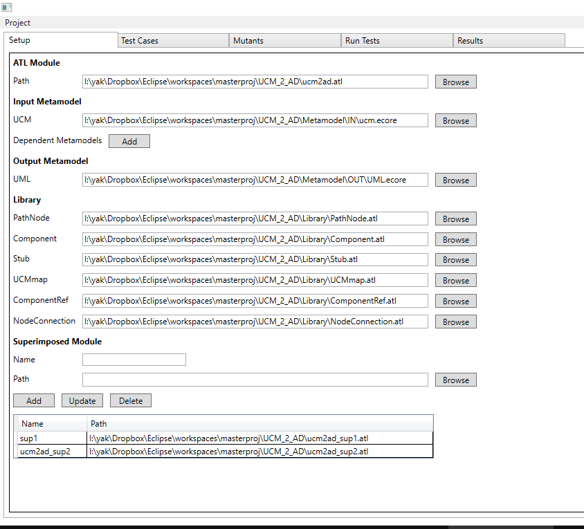
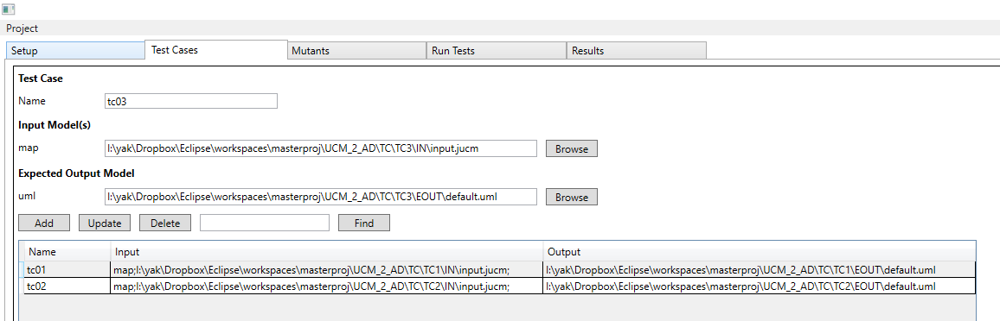
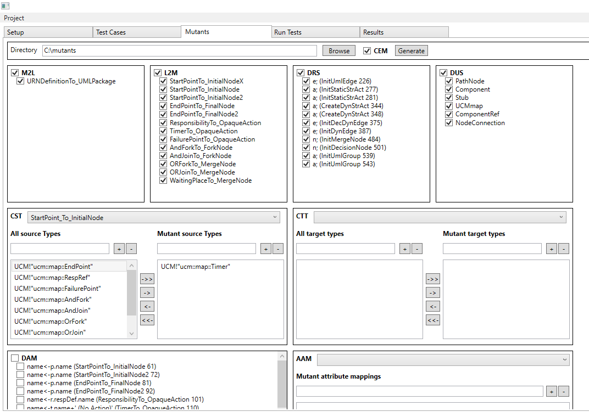
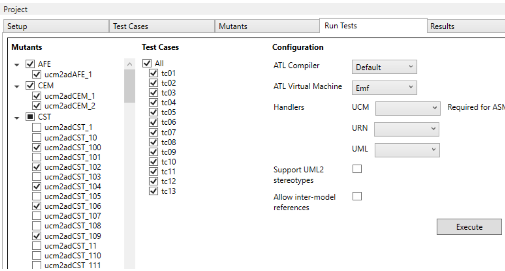
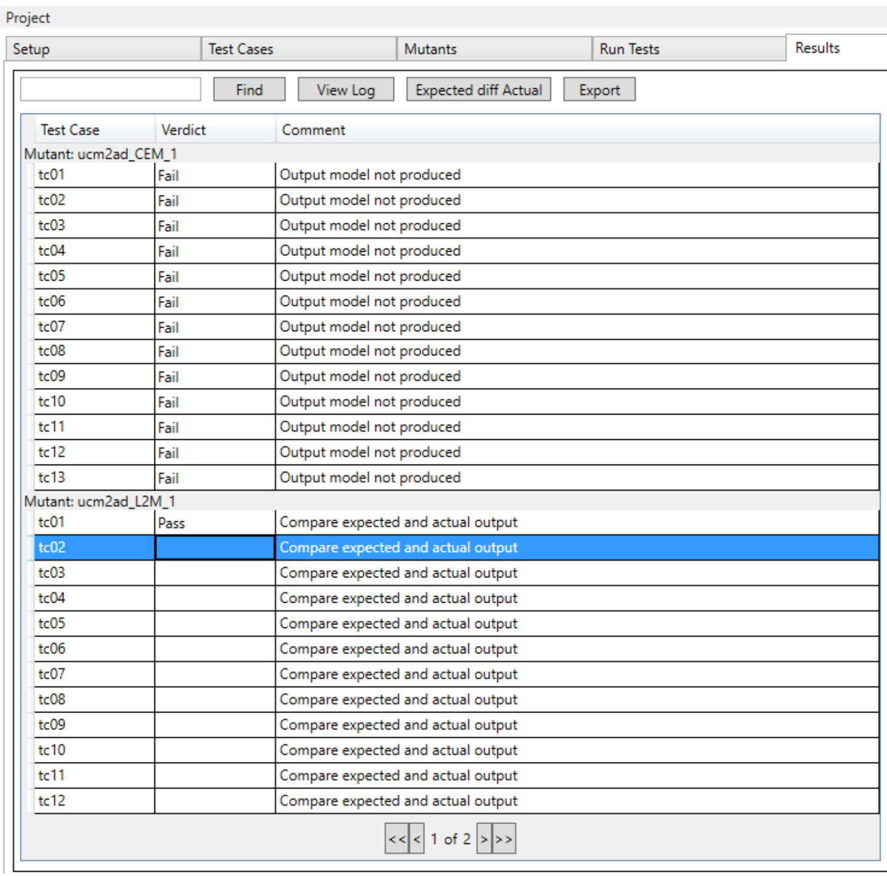

# MuAtl — Mutation Testing Tool for ATL Model Transformations

[](https://github.com/ybakhan/MuAtl)
[](https://github.com/ybakhan/MuAtl)
[](https://github.com/ybakhan/MuAtl)
[](https://github.com/ybakhan/MuAtl)
[](LICENSE)
[](https://doi.org/10.1109/ICSTW.2013.13)

> Research artifact accompanying the paper **"Mutation Operators for the Atlas Transformation Language"**, published at the [IEEE ICSTW 2013](https://doi.org/10.1109/ICSTW.2013.13).

Faults in model transformations propagate into defective models and eventually defective code — catching them at the transformation level is far cheaper than at the code level. MuAtl is a desktop tool that applies **mutation testing** to [ATL (Atlas Transformation Language)](https://eclipse.dev/atl/) programs. It automatically generates mutants by applying a suite of ATL-specific mutation operators, then runs a user-defined test suite against each mutant and reports which mutants were killed (detected) and which survived (live).

---

## Table of Contents

- [Mutation Operators](#mutation-operators)
- [Screenshots](#screenshots)
- [Architecture](#architecture)
- [Prerequisites](#prerequisites)
- [Getting Started](#getting-started)
- [Workflow](#workflow)
- [Publication](#publication)
- [License](#license)

---

## Mutation Operators

MuAtl implements **11 ATL-specific mutation operators**, derived from the ATL language semantics:

| Operator | Full Name | Description |
|----------|-----------|-------------|
| **M2L** | Matched-to-Lazy | Converts a matched rule to a lazy rule |
| **L2M** | Lazy-to-Matched | Converts a lazy rule to a matched rule |
| **DRS** | Delete Return Statement | Removes a return statement from a called rule |
| **DFE** | Delete Filtering Expression | Removes the guard/filter from an input pattern |
| **DUS** | Delete Using Statement | Removes a `uses` library import |
| **CEM** | Change Execution Mode | Toggles the transformation mode between `from` and `refining` |
| **DAM** | Delete Attribute Mapping | Removes a binding from an output pattern element |
| **CTT** | Change Target Type | Replaces the target metamodel type in an output pattern |
| **CST** | Change Source Type | Replaces the source metamodel type in an input pattern |
| **AAM** | Add Attribute Mapping | Inserts an additional binding into an output pattern element |
| **AFE** | Add Filtering Expression | Inserts a guard expression into an unfiltered input pattern |

---

## Screenshots

### 1 — Project Setup
Configure the ATL module, input/output metamodels, libraries, and superimposed modules.



### 2 — Test Cases
Define the test suite: each test case pairs an input model with an expected output model.



### 3 — Generate Mutants
Select which operators to apply and which rules to target, then generate all mutant ATL files.



### 4 — Run Tests
Execute the test suite against every generated mutant. Progress is shown in real time.



### 5 — Results
View pass/fail verdicts per mutant × test-case pair, inspect diffs, and export results to Excel.



---

## Architecture

MuAtl is a **C# WPF application** following the MVVM pattern, structured as two Visual Studio projects:

```
MuAtl.sln
├── MuAtl.Wpf/                  # Main application
│   ├── Model/                  # Domain models (project, mutants, test cases, results)
│   ├── Service/
│   │   ├── ATL.g4              # ANTLR4 grammar for ATL
│   │   ├── AtlTokenizer.cs     # Tokenises ATL source files
│   │   ├── AtlParser.cs        # Parses ATL into a parse tree
│   │   ├── Generator/          # Mutant generation (walks the parse tree, rewrites tokens)
│   │   ├── Reader/             # Reads project config and identifies mutation candidates
│   │   │   └── Model/          # One candidate type per operator (CstCandidate, DamCandidate, …)
│   │   ├── Runner/             # Executes mutants via the ATL/AMW Java engine (muatl.jar)
│   │   ├── Oracle.cs           # Compares actual vs expected output models (XMI diff)
│   │   └── ResultExporter.cs   # Exports results to .xlsx
│   └── ViewModel/              # MVVM ViewModels (one per tab)
└── MuAtl.Test/                 # NUnit test project
    ├── Service/                 # Unit tests for parser, generator, oracle, …
    └── ViewModel/               # Unit tests for ViewModels
```

**Key dependencies**

| Package | Purpose |
|---------|---------|
| [ANTLR4](https://www.antlr.org/) 4.3 | Parses ATL source into a parse tree for token rewriting |
| [MvvmLight](https://www.mvvmlight.net/) 5.2 | MVVM framework (commands, messaging, dispatcher) |
| [log4net](https://logging.apache.org/log4net/) 2.0 | Structured logging |
| Extended WPF Toolkit 2.4 | UI controls |
| `muatl.jar` | ATL/AMW engine — executes ATL transformations on EMF models |

---

## Prerequisites

- **Windows** (WPF is Windows-only)
- **.NET Framework 4.5**
- **Java Runtime Environment (JRE)** — required to execute the ATL engine (`muatl.jar`)
- **Visual Studio 2013+** (or MSBuild) to build from source
- NuGet package restore (runs automatically on first build)

---

## Getting Started

```bash
git clone https://github.com/ybakhan/MuAtl.git
cd MuAtl
```

Open `MuAtl.sln` in Visual Studio, restore NuGet packages, and build. Run the `MuAtl.Wpf` project.

> **Note:** `muatl.jar` is bundled in both `MuAtl.Wpf/` and `MuAtl.Test/`. It must reside alongside the executable at runtime.

---

## Workflow

| Step | Tab | What you do |
|------|-----|-------------|
| 1 | **Setup** | Point MuAtl at your `.atl` module, input/output `.ecore` metamodels, ATL library files, and any superimposed modules |
| 2 | **Test Cases** | Add test cases — each is a pair of (input XMI model, expected output XMI model) |
| 3 | **Mutants** | Select mutation operators and target rules; click **Generate** to produce all mutant `.atl` files on disk |
| 4 | **Run Tests** | Choose which mutants and test cases to execute; click **Execute** to run the ATL engine on each combination |
| 5 | **Results** | Inspect Kill/Live/Undetermined verdicts; use **Expected diff Actual** to inspect model differences; **Export** to `.xlsx` |

---

## Publication

If you use MuAtl or the mutation operators in your research, please cite:

```bibtex
@conference{Khan2013MuAtl,
  title     = {Mutation Operators for the Atlas Transformation Language},
  author    = {Yasser Khan and Jameleddine Hassine},
  booktitle = {Proceedings of the IEEE International Conference on Software Testing,
               Verification and Validation Workshops (ICSTW)},
  year      = {2013},
  pages     = {43--52},
  doi       = {10.1109/ICSTW.2013.13}
}
```

IEEE Xplore: [https://ieeexplore.ieee.org/document/6571607](https://ieeexplore.ieee.org/document/6571607)

---

## License

The MuAtl application code is released under the [MIT License](LICENSE).

The bundled ATL grammar file (`MuAtl.Wpf/Service/ATL.g4`) is Copyright 2015 Spikes N.V. and licensed under the [Apache License 2.0](https://www.apache.org/licenses/LICENSE-2.0), originally developed in the context of the [ARTIST EU project](http://www.artist-project.eu).